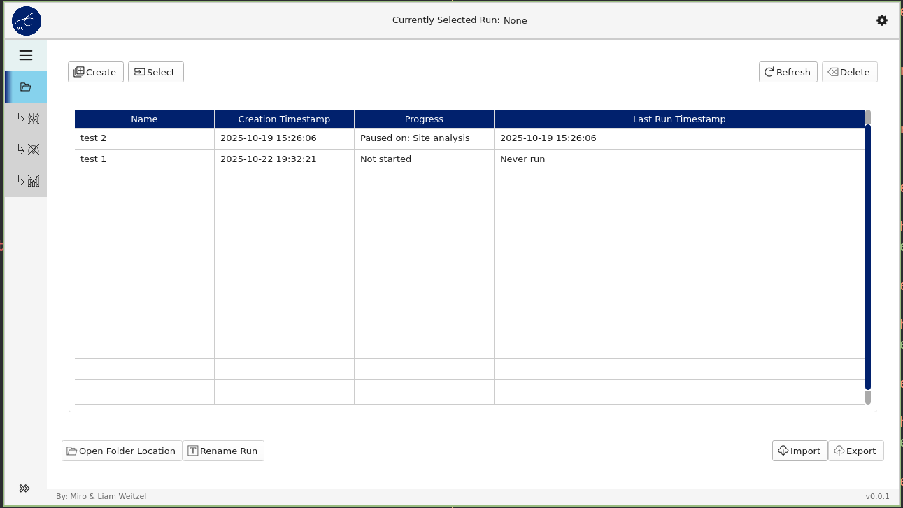
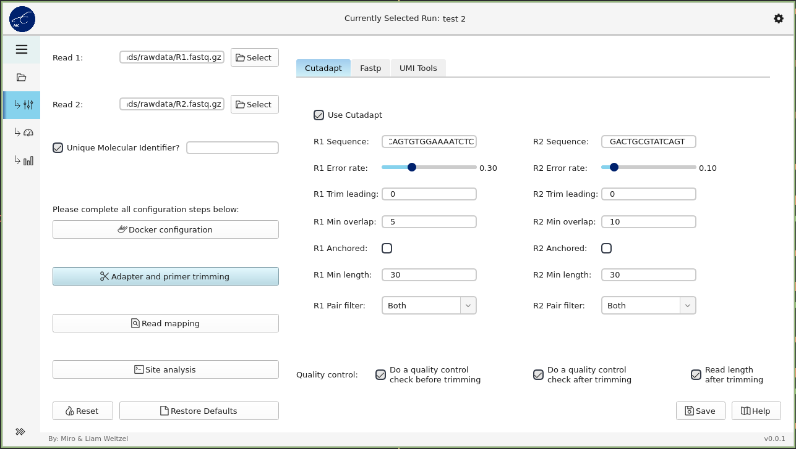
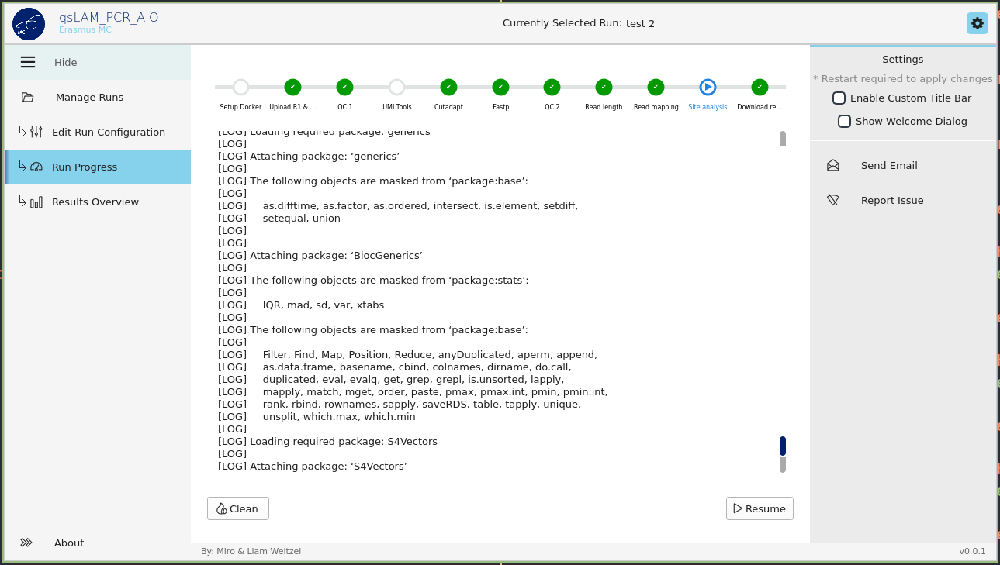
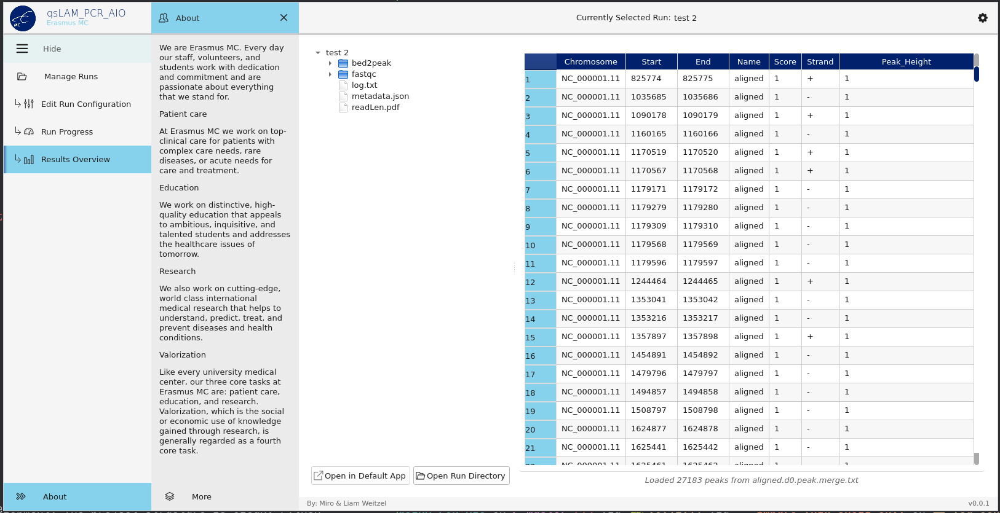

# qsLAM_PCR_AIO

[](https://python.org)
[](https://pypi.org/project/PySide6/)
[](https://docker.com)

**qsLAM_PCR_AIO** is a comprehensive desktop application for LAM-PCR integration site analysis. This tool provides an end-to-end pipeline for analyzing integration sites from raw reads to annotated profiles, helping researchers visualize, filter, and export results in one unified interface.

## 📸 Screenshots

### Run Management

*Create, import, export, and manage analysis runs*

### Run Configuration

*Configure pipeline parameters and settings for your analysis*

### Run Progress

*Monitor pipeline execution with real-time progress tracking*

### Results Overview

*View and analyze your integration site analysis results*

## 🚀 Getting Started

1. Clone the repository:
```bash
git clone https://github.com/Liam-Weitzel/qsLAM_PCR_AIO.git
cd qsLAM_PCR_AIO
```

2. Install Python dependencies:
```bash
nix develop
```

3. Launch the application:
```bash
python main.py
```

## 🤝 Contributing

We welcome contributions! Please feel free to:

- Submit feature requests
- Contribute code improvements
- Improve documentation

## 📧 Support

- **Email**: [liam.weitzel2@gmail.com](mailto:liam.weitzel2@gmail.com?subject=qsLAM_PCR_AIO%20Support)
- **Issues**: [GitHub Issues](https://github.com/Liam-Weitzel/qsLAM_PCR_AIO/issues)

## 📄 License

This project is licensed under the MIT License - see the [LICENSE](LICENSE) file for details.

## 🙏 Acknowledgments

- UI framework based on [Modern GUI PyDracula](https://github.com/Wanderson-Magalhaes/Modern_GUI_PyDracula_PySide6_or_PyQt6)
- Pipeline components adapted from [LVIS Pipeline](https://github.com/jyyulab/LVIS_pipeline)

## 🏥 Institution

**Erasmus Medical Center**
Rotterdam, The Netherlands
